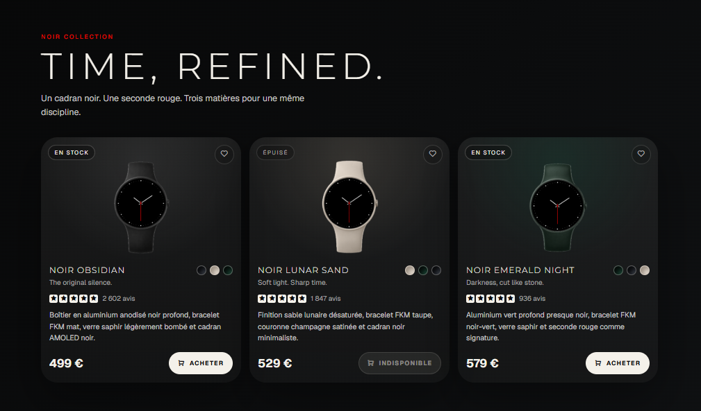

# Product Card

Page de cartes produits realisee avec HTML5 et CSS vanilla pour presenter une collection de montres NOIR avec images, variantes, avis, prix et etats de disponibilite.



## Demo

- GitHub Pages : https://osiris-balonga.github.io/product-card/
- Repository : https://github.com/Osiris-Balonga/product-card

## Objectif

Ce projet repond au livrable de cartes produits demande dans la phase HTML/CSS/Git. Il montre plusieurs produits dans une grille responsive avec une hierarchie claire entre image, nom, description, avis, prix et actions.

## Fonctionnalites

- Cartes produits responsives
- Images produit locales
- Badges de statut en stock ou epuise
- Bouton d'achat avec etat desactive si le produit est indisponible
- Bouton favori CSS-only avec coeur rempli au clic
- Design adapte aux ecrans 12 pouces et 16 pouces

## Technologies

- HTML5 semantique
- CSS3
- Variables CSS
- Remix Icon
- Google Fonts

## Structure

```text
product-card/
  images/
  index.html
  products.html
  styles.css
  README.md
```
